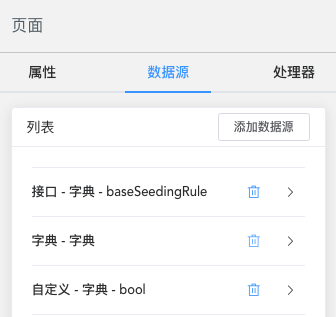
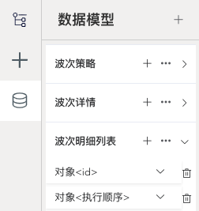

# 数据源

数据源，为组件提供数据，管理页面的数据模型。

## 简介

#### 组件数据源

我们可以在任意组件上配置数据源，配置数据保存在组件的 `$dataSource` 属性中，在组件挂载时被解析，解析结果保存在组件实例的 `dataSource` 字段中。`dataSource` 在组件树中逐级传递，在表达式中可以通过 `this.dataSource` 访问到当前数据上下文。

组件数据源配置：选中需要配置数据源的组件，在右侧配置面板中，切换到 **数据源** 标签。



数据源配置示例：

```json
$dataSource": [{
  "type": "dict",
  "subtype": "dict",
  "root": "data",
  "dict": [{
    "code": "status",
    "type": "string"
  }]
}]
```

#### 数据模型

数据模型，是当面页面的业务数据对象。通过维护数据模型，可以快速的配置表格、表单组件，示例参考 [配置表格](../#配置表格) 和 [配置搜索表单](../配置搜索表单)。



## 字典

字典是 web页面里最常见的数据源之一，为[下拉框](../components/form/select)、[单选框](../components/form/radio)、[复选框](../components/form/checkbox)、[穿梭框](../components/form/transfer)等组件提供数据。

创建字典数据源有三种方式：

| 类型 | 子类型 |
| ---- | ---- |
| 接口 | 字典 |
| 字典 | 字典 |
| 自定义 | 字典 |

::: leivii
```js {10-31,46-57,73-90}
{
	"$id": "geek-form-shqUgq0FzGkP",
	"$type": "geek-form",
	"$visible": true,
	"$body": [{
			"$id": "geek-select-Lu4qYRJauMNO",
			"$type": "geek-select",
			"$visible": true,
			"$prop": "select1",
			"$dataSource": [{
				"type": "api",
				"subtype": "dict",
				"autoProcess": true,
				"scoped": true,
				"cache": false,
				"root": "data",
				"method": "GET",
				"api": "/api/warehouselist",
				"params": {
					"type": "custom",
					"target": "",
					"action": {}
				},
				"data": {
					"type": "custom",
					"action": {}
				},
				"label": "warehouseName",
				"value": "warehouseCode",
				"key": "select1"
			}],
			"$classes": null,
      "prop": "api",
			"popperClass": null,
			"clearable": null,
			"multiple": null,
			"allowCreate": null,
			"filterable": null,
			"label": "接口",
			"disabled": null
		},
		{
			"$id": "geek-select-D0eAx2navVcM",
			"$type": "geek-select",
			"$visible": true,
			"$dataSource": [{
				"type": "dict",
				"subtype": "dict",
				"autoProcess": true,
				"scoped": true,
				"cache": false,
				"root": "data",
				"dict": [{
					"code": "status",
					"type": "string"
				}]
			}],
			"$classes": null,
      "prop": "dict",
			"popperClass": null,
			"clearable": null,
			"multiple": null,
			"allowCreate": null,
			"filterable": null,
			"label": "字典",
			"disabled": null,
			"$prop": "status"
		},
		{
			"$id": "geek-select-gEFIz8duVVrJ",
			"$type": "geek-select",
			"$visible": true,
			"$dataSource": [{
				"type": "custom",
				"subtype": "dict",
				"autoProcess": true,
				"scoped": true,
				"cache": false,
				"root": "data",
				"dictValue": [{
						"label": "北京",
						"value": "bj"
					},
					{
						"label": "苏州",
						"value": "sz"
					}
				],
				"key": "custom"
			}],
			"$classes": null,
      "prop": "custom",
			"popperClass": null,
			"clearable": null,
			"multiple": null,
			"allowCreate": null,
			"filterable": null,
			"label": "自定义",
			"disabled": null,
			"$prop": "custom"
		}
	],
	"grids": [],
	"$classes": null,
	"gutter": 30,
	"cols": 3
}
```
:::

## 列表

列表通常为 [表格](../components/data/table) 组件提供数据源。参考下面组件的配置：

::: leivii
```js {5-25}
{
  "$id": "geek-table-HNuO2ApPoEaL",
  "$type": "geek-table",
  "$visible": true,
  "$dataSource": [{
    "type": "api",
    "subtype": "LIST",
    "autoProcess": true,
    "scoped": true,
    "cache": false,
    "root": "data",
    "method": "GET",
    "api": "/api/tablelist",
    "params": {
      "type": "component",
      "target": "",
      "action": "",
      "params": []
    },
    "data": {
      "type": "custom",
      "action": {}
    },
    "key": "table"
  }],
  "actions": [],
  "columns": [{
      "name": "warehouseCode",
      "label": "lang.wms.fed.warehouseNum",
      "minWidth": 0,
      "tooltip": false,
      "fixed": "",
      "$body": [],
      "type": "text"
    },
    {
      "name": "warehouseName",
      "label": "lang.wms.fed.warehouseName",
      "minWidth": 0,
      "tooltip": false,
      "fixed": "",
      "$body": [],
      "type": "text"
    },
    {
      "name": "workareaCode",
      "label": "lang.wms.fed.workAreaCode",
      "minWidth": 0,
      "tooltip": false,
      "fixed": "",
      "$body": [],
      "type": "text"
    },
    {
      "name": "workareaName",
      "label": "lang.wms.fed.workArea",
      "minWidth": 0,
      "tooltip": false,
      "fixed": "",
      "$body": [],
      "type": "text"
    },
    {
      "name": "creationDate",
      "label": "lang.wms.fed.exchangeTask.creationTime",
      "minWidth": 0,
      "tooltip": false,
      "fixed": "",
      "$body": [],
      "type": "time"
    },
    {
      "name": "creator",
      "label": "lang.wms.fed.creater",
      "minWidth": 0,
      "tooltip": false,
      "fixed": "",
      "$body": [],
      "type": "text"
    }
  ],
  "$classes": null,
  "fitWidth": true,
  "showSelection": null,
  "showIndex": null,
  "showPagination": true,
  "filterable": null,
  "$prop": "table"
}
```
:::

## 分页列表

分页列表也是为 [表格](../components/data/table) 组件提供数据源，**列表** 使用在不分页、或前端分页的列表类组件上，而 **分页列表** 使用后端分页。

::: leivii
```js {5-41}
{
  "$id": "geek-table-HNuO2ApPoEaL",
  "$type": "geek-table",
  "$visible": true,
  "$dataSource": [{
    "type": "api",
    "subtype": "PAGING_LIST",
    "autoProcess": true,
    "scoped": true,
    "cache": false,
    "root": "data",
    "method": "GET",
    "api": "/api/tablepaginglist",
    "params": {
      "type": "component",
      "target": "geek-table-HNuO2ApPoEaL",
      "action": "getPagination",
      "params": [{
          "type": "doc",
          "target": "",
          "action": "currentPage",
          "name": "e=\"currentPage\""
        },
        {
          "type": "doc",
          "target": "",
          "action": "pageSize",
          "name": "t=\"pageSize\""
        }
      ]
    },
    "data": {
      "type": "custom",
      "action": {}
    },
    "page": "currentPage",
    "size": "pageSize",
    "total": "total",
    "list": "list",
    "key": "table"
  }],
  "actions": [],
  "columns": [{
      "name": "warehouseCode",
      "label": "lang.wms.fed.warehouseNum",
      "minWidth": 0,
      "tooltip": false,
      "fixed": "",
      "$body": [],
      "type": "text"
    },
    {
      "name": "warehouseName",
      "label": "lang.wms.fed.warehouseName",
      "minWidth": 0,
      "tooltip": false,
      "fixed": "",
      "$body": [],
      "type": "text"
    },
    {
      "name": "workareaCode",
      "label": "lang.wms.fed.workAreaCode",
      "minWidth": 0,
      "tooltip": false,
      "fixed": "",
      "$body": [],
      "type": "text"
    },
    {
      "name": "workareaName",
      "label": "lang.wms.fed.workArea",
      "minWidth": 0,
      "tooltip": false,
      "fixed": "",
      "$body": [],
      "type": "text"
    },
    {
      "name": "creationDate",
      "label": "lang.wms.fed.exchangeTask.creationTime",
      "minWidth": 0,
      "tooltip": false,
      "fixed": "",
      "$body": [],
      "type": "time"
    },
    {
      "name": "creator",
      "label": "lang.wms.fed.creater",
      "minWidth": 0,
      "tooltip": false,
      "fixed": "",
      "$body": [],
      "type": "text"
    }
  ],
  "$classes": null,
  "fitWidth": true,
  "showSelection": null,
  "showIndex": null,
  "showPagination": true,
  "filterable": null,
  "$prop": "table"
}
```
:::

> 注意数据源参数的配置，请求参数为表格的分页方法。

## 对象

对象数据源，为对象展示类组件提供数据源。如 [表单](../components/form/form) 组件。

::: leivii
```js {5-24}
{
	"$id": "geek-form-pKKGHZTUWaPd",
	"$type": "geek-form",
	"$visible": true,
	"$dataSource": [{
		"type": "api",
		"subtype": "SINGLE",
		"autoProcess": true,
		"scoped": true,
		"cache": false,
		"root": "data",
		"method": "GET",
		"api": "/api/form",
		"params": {
			"type": "custom",
			"target": "",
			"action": {}
		},
		"data": {
			"type": "custom",
			"action": {}
		},
		"key": "formData"
	}],
	"$body": [{
			"$id": "geek-input-W4pTdJ2qqBCE",
			"$type": "geek-input",
			"$visible": true,
			"prop": "item1",
			"$classes": null,
			"rows": 0,
			"maxlength": 0,
			"disabled": null,
			"$prop": ""
		},
		{
			"$id": "geek-input-KzEP8fUOrnmt",
			"$type": "geek-input",
			"$visible": true,
			"prop": "item2",
			"$classes": null,
			"rows": 0,
			"maxlength": 0,
			"disabled": null
		},
		{
			"$id": "geek-input-number-LwdKUs9AUK0r",
			"$type": "geek-input-number",
			"$visible": true,
			"prop": "item3",
			"$classes": null,
			"placeholder": "",
			"precision": 0,
			"disabled": null
		}
	],
	"grids": [],
	"$classes": null,
	"gutter": 30,
	"cols": 3,
	"$prop": "formData"
}
```
:::

## 云函数

云函数，是一种综合数据源类型，可以提供列表、分页列表、对象和字典类型的数据。**类型栏** 选择云函数，Leivii 编辑器会加载 `dataTrickle` 表里保存的脚本列表，在 **云函数栏** 选择所需的云函数名称即可。

## 插件

插件，是一种扩展数据源类型，也包含了列表、分页列表、对象和字典类型的数据。开发者需要先注册插件，详情请移步 [插件机制](../advanced/plugin)。**类型栏** 选择插件，在 **插件名称栏** 选择所需的插件，**插件方法栏** 选择该插件的具体方法即可。

## 数据模型

数据模型，包含基础模型和云函数两种类型，是对具体业务数据的描述。在数据模型中，需要指定模型字段的国际化名称及数据类型。

### 模型

模型的创建有两种方式：

1、手动添加数据模型。

在左侧数据模型标签页中，点击右上角的 `+` 按钮，选择创建模型，输入模型名称，如“批次属性”，即完成了模型创建。接下来，点击“批次属性”右侧的 `+` 按钮，为模型添加字段。

::: img 手动添加数据模型
../assets/img/datasource-10.png
:::

2、通过数据源创建数据模型。

选择 [表格](../components/data/table) 组件，点击右侧配置面板的数据源标签，创建 [列表](#列表) 或[分页列表](#分页列表) 数据源，完成后点击 **创建数据模型** 按钮，输入模型名称，即可创建包含当前数据源所有字段的数据模型。

::: img 通过数据源创建数据模型
../assets/img/datasource-11.png
:::

### 云函数

云函数，通过 `groovy` 或 `SQL` 的方式，为页面提供业务数据。Leivii 编辑器内置了脚本编辑器，我们可以在页面上运行、调试代码，配置字段，并生成搜索和表格组件。

创建云函数步骤：

1、创建云函数

::: img 创建云函数
../assets/img/datasource-21.png
:::

2、调试云函数代码

::: img 调试云函数代码
../assets/img/datasource-22.png
:::

3、配置字段

::: img 配置字段
../assets/img/datasource-23.png
:::

4、页面配置

::: img 页面配置
../assets/img/datasource-24.png
:::

5、生成页面

::: img 生成页面
../assets/img/datasource-25.png
:::

### 通过数据模型配置组件

示例参考 [配置表格](../#配置表格) 和 [配置搜索表单](../配置搜索表单)。
