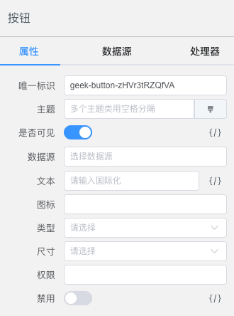

# DSL

DSL，是 Domain Specific Language 的缩写，中文翻译为 **领域特定语言**。

## 简介

DSL 是为了解决某一类任务而专门设计的计算机语言。比如文档编写有 markdown，字符串匹配有 RegExp，任务控制有 make、gradle，数据操作有 SQL，Web 有 HTML、CSS等。他们的本质和我们软件工程问题的解决思路一样，**通过限定问题域边界，从而锁定复杂度，提高编程效率。**

我们通过一个简单的例子，来了解下 DSL。比如表示 **2周前的时间**：

解一
```js
new Date(Date.now() - 1000 * 60 * 60 * 24 * 7 * 2);
```

解二
```bash
2 weeks ago
```

解三
```js
(2).weeks().ago();
```

解一是符合通用编程思维的答案，但即使作为程序员的我们也无法一眼看出其含义。

解二和解三其实就是 DSL 的两种不同类型 —— 外部DSL 和 内部DSL，它们的可阅读性显然更高。

### 外部DSL

解二称之为 外部DSL，它是一种独立的编程语言，需要从解析器开始实现自己的编译工具，成本较高。但它的语法灵活性更高，表现力强。

前端常用的模板引擎如 mustache、 Vue、React支持的 JSX 语法、LESS / SCSS，都属于 外部DSL。

mustache 的例子：

```html
<h2>Names</h2>
{{#names}}
<strong>{{name}}</strong>
{{/names}}
```

### 内部DSL

解三称之为 内部DSL，它是建立在其他宿主语言之上的特殊 DSL，它与宿主语言共享编译与调试工具等基础设施，学习成本更低，也更容易被集成。它在语法上与宿主语言同源，但在运行时上需要做额外的封装。

你也可以将 内部DSL 视为针对特定任务的特殊接口封装风格，比如 jQuery 就是针对 DOM 操作的一种 内部DSL。

内部DSL 的语法灵活度和语法噪音取决于宿主语言的选择。

### 我们的选择

低代码需要更大的灵活度的拓展性，所以我们选择了 外部DSL。在实现上，采用了大家熟知的 JSON 作为描述载体，由 [Leivii运行时](../install) 来管理组件 Schema，并解析、渲染和执行 DSL。用户通过 [Leivii编辑器](../install) 可视化配置业务页面，生成 DSL。


## Schema

Leivii 使用基于 JSON 的 外部DSL 描述页面组件树、数据源和交互逻辑。数据源为组件提供上下文数据，交互逻辑即 [处理器](./handler)，用来描述组件之间的交互详情。

组件是 Leivii 的一等公民和最小抽象原子，在 [介绍](../#组件) 页面，讲述了组件的抽象：

> 1、属性：即组件的 `props`，对应编辑器的属性面板。
>
> 2、方法：即组件对外提供的功能。
>
> 3、事件：即组件完成本身功能后，抛出的事件消息。
>
> 其中2、3是 [处理器](#处理器) 的基础。

DSL 如何描述一个组件呢？我们先来回顾一下 Hello World 的例子吧。

::: leivii
```js
{
  $id: 'geek-text',
  $type: 'geek-text',
  $visible: true,
  text: 'Hello World'
}
```
:::

上面例子中，我们称以 `$` 开头的属性为系统属性，除了 `$id`、`$type`、`$visible` 外，我们还需要 **数据源**、**处理器**等字段来描述通用属性，下面我们来看下组件的通用 Schema。

```json
{
  "type": "object",     
  "properties": {      
    "$id": { "type": "string" }, // 唯一标识
    "$type": { "type": "string" }, // 组件名称
    "$visible": { "type": "boolean" }, // 是否可见
    "$classes": { "type": "string" }, // 主题
    "$body": { "type": "array" }, // 子节点
    "$dataSource": { "type": "array" }, // 数据源配置
    "$handlers": { "type": "array" }, // 处理器配置
    "$prop": { "type": "string" }, // 数据源字段
  },
  "required": ["$id", "$type", "$visible"],
  "additionalProperties": true
}
```

> 其中 `additionalProperties` 表示组件可以任意的添加业务属性字段。

## PropAPI

为了更好的描述组件功能，我们在 Vue Props 的基础上，添加了更多配置项，统称为 PropAPI。对应的 `ts` 声明如下：

```ts
interface PropOptions<T=any> {
  /** 类型 */
  type?: PropType<T>
  /** 必填 */
  required?: boolean
  /** 默认值 */
  default?: T | null | undefined | (() => T | null | undefined);
  /** 标题 */
  label?: string
  /** 值的可选项 */
  options?: SelectOptions[]
  /** 显示条件表达式，如 '{{type}} = dict' */
  visible?: boolean
  /** 指定属性编辑类 */
  clazz?: string | object
  /** 指定数组元素编辑类 */
  itemClazz?: string
  /** 指定对象值的编辑类 */
  valueClazz?: string
  /** 是否支持表达式 */
  isExpression?: boolean
  /** 是否显示到对象标题 */
  title?: boolean
  /** 编辑器忽略 */
  ignore: boolean
}
```

因此，我们在开发组件时，可以做如下配置：

```js
// button.vue
props: {
  $body: {
    ignore: true
  },
  text: {
    type: String,
    clazz: 'I18n',
    label: '文本'
  },
  icon: {
    type: String,
    label: '图标'
  },
  type: {
    type: String,
    options: [{label: '主色', value: 'primary'}, {label: '成功', value: 'success'}, {label: '警告', value: 'warning'}, {label: '危险', value: 'danger'}, {label: '信息', value: 'info'}, {label: '文本', value: 'text'}],
    label: '类型'
  },
  size: {
    type: String,
    options: [{label: '迷你', value: 'mini'}, {label: '小', value: 'small'}, {label: '正常', value: 'medium'}],
    label: '尺寸'
  },
  authCode: {
    type: String,
    clazz: 'Auth',
    label: '权限'
  },
  disabled: {
    type: Boolean,
    isExpression: true,
    default: false,
    label: '禁用'
  }
}
```

Leivii 解析如下图。



其中 `clazz: 'I18n'` 被 [属性编辑器](../advanced/prop) 解析成对应的属性编辑组件。`isExpression: true` 标记的属性即 [表达式](./expression)，可以点击属性值右侧的 `{/}` 图标唤起表达式编辑窗口。
