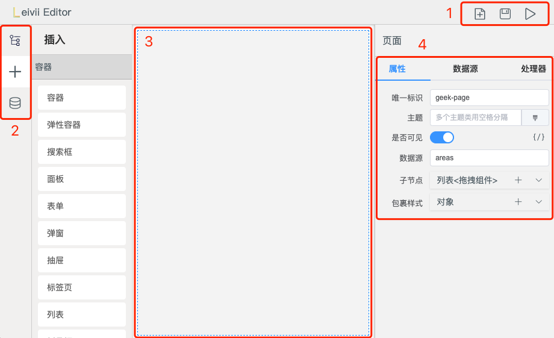
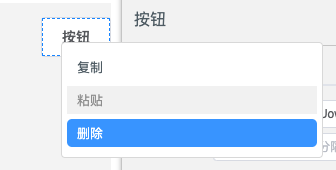
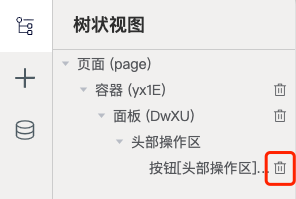

# 编辑器操作指南

Leivii 编辑器使用介绍，本篇为大家介绍编辑器常用的操作及技巧。

## 布局

编辑器页面分为4个区域：

1、操作区

操作区内置了 **保存**、**预览** 功能。支持自定义扩展图标，如 **新建** 。

2、功能标签页

左侧功能标签页包含组件的 **树状视图**、**插入** 和 **数据模型**。

3、舞台

舞台即页面操作区域，用户可以从 **插入** 标签页中拖入需要的组件，并在舞台区域拖拽 & 编辑。

4、配置面板

配置面板用来配置组件的功能，包含 **属性**、**数据源** 和 **处理器**。

## 拖组件

#### 拖入舞台

在 **功能标签页** 中选中 **插入** 标签，将所需的组件拖入 **舞台** 区域。在拖入组件前，需要先在舞台上选中目标组件，如果目标组件为非容器类型，组件将拖入目标组件的父容器中。

::: video loop autoplay muted
../assets/video/editor-1.mp4
:::

#### 拖入属性字段

当选中组件的字段 `clazz属性` 配置为 `组件拖放（ComponentDragger）` 时（参考 [注册属性编辑器](../advanced/prop)），组件可以拖入 **配置面板** 的对应属性中。

::: video loop autoplay muted
../assets/video/editor-2.mp4
:::

## 删除组件

最简单的办法是在组件上右键，选择删除。

另外我们可以在左侧 **功能标签页** 中选中 **树状视图**，点击所要删除的组件右侧的 **删除** 按钮。

## 复制组件

在要复制的组件上右键，选择 **复制**。在要粘贴的组件上右键，选择 **粘贴**。

::: video loop autoplay muted
../assets/video/editor-3.mp4
:::

## 移动组件

先选中目标组件，将要移动的组件拖入到选中区域。

::: video loop autoplay muted
../assets/video/editor-4.mp4
:::

## 配置面板

#### 配置组件属性

选中目标组件，在右侧 **配置面板** 的 **属性** 标签页中，配置组件的相关属性。

::: video loop autoplay muted
../assets/video/editor-5.mp4
:::

#### 配置组件数据源

选中目标组件，在右侧 **配置面板** 的 **数据源** 标签页中，配置组件的数据源。

::: video loop autoplay muted
../assets/video/editor-6.mp4
:::

#### 配置组件处理器

选中目标组件，在右侧 **配置面板** 的 **处理器** 标签页中，配置组件的处理器。

::: video loop autoplay muted
../assets/video/editor-7.mp4
:::
