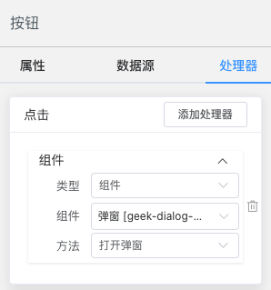

# 处理器

处理器，处理组件之间的交互，及组件的业务逻辑。

## 简介

处理器的设计借鉴了游戏中 `精灵` 的交互机制，**用组件的方法响应组件抛出的事件**。基于此设计，我们在开发组件时，只需要关注组件本身的逻辑，及对外的“接口”：**属性**、**方法** 和 **事件**。

我们来看一个最简单的处理器配置，点击按钮打开弹窗，选择 [按钮](../components/basic/button) 组件，在右侧属性面板中选择处理器标签，在 **点击** 卡片中点击 **添加处理器**，拖入/选择 [弹窗](../components/container/dialog) 组件，选择 **打开弹窗**。



按钮处理器配置如下：

```js
[{
  "type": "component",
  "name": "click",
  "target": "geek-dialog-RBsmCSM1E9Uz",
  "action": "open",
  "params": []
}]
```

## 基本示例

点击按钮打开弹窗的示例

::: leivii
```js {7-15}
[
  {
    "$id": "geek-button",
    "$type": "geek-button",
    "$visible": true,
    "text": "点我",
    "$handlers": [
      {
        "type": "component",
        "name": "click",
        "target": "geek-dialog-RBsmCSM1E9Uz",
        "action": "open",
        "params": []
      }
    ]
  },
  {
    "$id": "geek-dialog-RBsmCSM1E9Uz",
    "$type": "geek-dialog",
    "$visible": true,
    "title": "弹窗"
  }
]
```
:::

## 下拉框联动

我们来看下省市联动的经典案例：

::: leivii
```js {43-72,89-100}
{
  "$id": "geek-form-cfs3AM4pqx4N",
  "$type": "geek-form",
  "$visible": true,
  "$body": [
    {
      "$id": "geek-select-Y2i0mJFFpfYR",
      "$type": "geek-select",
      "$visible": true,
      "$dataSource": [
        {
          "type": "api",
          "subtype": "dict",
          "autoProcess": true,
          "scoped": true,
          "cache": false,
          "root": "data",
          "method": "GET",
          "api": "/api/provinces",
          "params": {
            "type": "custom",
            "target": "",
            "action": {}
          },
          "data": {
            "type": "custom",
            "action": {}
          },
          "label": "name",
          "value": "code",
          "key": "provinces"
        }
      ],
      "$classes": null,
      "popperClass": null,
      "clearable": null,
      "multiple": null,
      "allowCreate": null,
      "filterable": null,
      "disabled": null,
      "$prop": "provinces",
      "prop": "province",
      "$handlers": [
        {
          "type": "component",
          "name": "change",
          "target": "geek-select-R6zLHIUlkoKf",
          "action": "updateDataSource",
          "params": [
            {
              "type": "doc",
              "target": "",
              "action": {},
              "name": "config = {}"
            }
          ]
        },
        {
          "type": "component",
          "name": "change",
          "target": "geek-select-R6zLHIUlkoKf",
          "action": "setValue",
          "params": [
            {
              "type": "expression",
              "target": "",
              "action": "",
              "name": "v"
            }
          ]
        }
      ],
      "label": "lang.wms.fed.province"
    },
    {
      "$id": "geek-select-R6zLHIUlkoKf",
      "$type": "geek-select",
      "$visible": true,
      "$dataSource": [
        {
          "type": "api",
          "subtype": "dict",
          "autoProcess": true,
          "scoped": true,
          "cache": false,
          "root": "data",
          "method": "GET",
          "api": "/api/cities",
          "params": {
            "type": "custom",
            "target": "",
            "action": {
              "province": {
                "type": "component",
                "target": "geek-select-Y2i0mJFFpfYR",
                "action": "getValue",
                "params": []
              }
            }
          },
          "data": {
            "type": "custom",
            "action": {}
          },
          "label": "name",
          "value": "code",
          "key": "cities"
        }
      ],
      "$classes": null,
      "popperClass": null,
      "clearable": null,
      "multiple": null,
      "allowCreate": null,
      "filterable": null,
      "disabled": null,
      "$prop": "cities",
      "prop": "city",
      "label": "lang.wms.fed.city"
    }
  ],
  "grids": [],
  "$classes": null,
  "gutter": 30,
  "cols": 2
}
```
:::

上面的例子中，首先设置省市的数据源（来自mock），在市的数据源中，添加省参数，见示例 `89-100` 行配置，编辑器如下图示：

::: img 市数据源参数
../assets/img/handler-12.png
:::

设置省处理器，见示例 `43-72` 行，编辑器如下图示：

::: img 省处理器
../assets/img/handler-13.png
:::

## 请求接口

点击按钮，请求一个接口。给按钮添加点击处理器，拖入按钮组件，**方法** 栏选择 **请求接口**，完善接口配置即可。

::: leivii
```js {7-30}
{
  "$id": "geek-button",
  "$type": "geek-button",
  "$visible": true,
  "text": "请求接口",
  "$handlers": [
    {
      "type": "component",
      "name": "click",
      "target": "geek-button",
      "action": "$axios",
      "params": [
        {
          "type": "doc",
          "target": "",
          "action": {
            "url": "/api/form",
            "method": "GET",
            "params": {
              "type": "component",
              "target": "",
              "action": ""
            },
            "data": {},
            "dataType": null
          },
          "name": "options"
        }
      ]
    },
    {
      "type": "component",
      "name": "click",
      "target": "geek-button",
      "action": "$message",
      "params": [
        {
          "type": "doc",
          "target": "",
          "action": {
            "type": "success",
            "message": "请求成功"
          },
          "name": "options"
        }
      ]
    }
  ],
  "$classes": null,
  "disabled": null
}
```
:::

> 可以在控制台查看接口调用情况。
