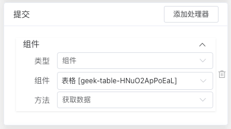

# Quick Start

## What is Leivii Editor

Leivii 是一个专注于前端低代码的在线IDE。与其他流行的表单/大屏/工作流低代码不同的是，Leivii被设计为二次开发友好的通用框架。Leivii抽象简单，不仅易于上手，还便于与第三方库或既有项目整合；另一方面，借助组件交互处理器的设计，用户可以像做游戏一样，实现复杂的应用交互。

如果你想在深入学习 Leivii 之前对它有更多了解，我们制作了一个视频，带您了解其核心概念。

::: video controls preload width=600 poster=../assets/img/poster.png
../assets/video/leivii.mp4
:::

::: tip 为什么叫 Leivii ？
Leivii，读作“雷卫”，来自《星辰变》
:::

## Getting Started

<a class="button" href="install.html">安装</a>

尝试Leivii最简单的方法是使用 Hello World 例子。你可以打开下面的代码示例，查看配置，学习一些基础用法；或者选择在`编辑器中打开`，在弹出的编辑器中了解更多。

::: leivii
```js
{
  $id: 'geek-text',
  $type: 'geek-text',
  $visible: true,
  text: 'Hello World'
}
```
:::

[安装教程](./install)给出了详细的安装 Leivii 的方式。你也可以通过阅读下面的教程，先来了解一下编辑器的核心概念。

## Component

在 Leivii 中，组件为最小的操作单位。我们以组件的三大特征为核心抽象，构建了 Leivii 的核心：

1、属性：即组件的 `props`，对应编辑器的属性面板。

2、方法：即组件对外提供的功能。

3、事件：即组件完成本身功能后，抛出的事件消息。

其中2、3是 [处理器](#处理器) 的基础。

## DSL

[DSL](design/dsl)，是基于 `JSON` 的外部领域特定语言，包含了页面的组件树、数据和交互的配置。借助 Leivii 编辑器，我们通过可视化方式，即可完成复杂的业务逻辑。

下面我们实现一个典型后端管理页面的示例，首先拖入搜索框、表单、表格。
选中表格，在右侧配置面板中，打开 **自适应宽** 和 **分页**。

::: leivii
```js
{
  "$id": "geek-page",
  "$type": "geek-page",
  "$visible": true,
  "$body": [{
    "$id": "geek-search-bar-VlueT9UAaq3a",
    "$type": "geek-search-bar",
    "$visible": true,
    "$body": [{
      "$id": "geek-form-w45TzyIx7C0I",
      "$type": "geek-form",
      "$visible": true
    }],
    "actions": [],
    "$classes": null,
    "unfoldNum": 0,
    "folded": null
  }, {
    "$id": "geek-table-HNuO2ApPoEaL",
    "$type": "geek-table",
    "$visible": true,
    "actions": [],
    "columns": [],
    "$classes": null,
    "fitWidth": true,
    "showSelection": null,
    "showIndex": null,
    "showPagination": true
  }]
}
```
:::

## DataSource

数据源包括组件数据源和数据模型

接下来，我们为已有组件配置数据

### 配置表格

点击表格组件，在右侧配置区域选中数据源，配置如下：

::: img 数据源配置
../assets/img/datasource-1.png
:::

点击 **创建数据模型** 按钮，输入模型名称“表格”，完成模型创建。在左侧数据模型标签页中，完善对字段的描述，示例如下：

::: img 数据模型配置
../assets/img/datasource-2.png
:::

切换至表格属性面板，在 **列** 属性栏选择 **配置列**，在列配置弹窗中选择需要的字段，效果如下：

::: img 表格配置列
../assets/img/column-config.png
:::

配置完成后，表格的列就能正常显示了！

::: leivii
```js
{
  "$id": "geek-table-HNuO2ApPoEaL",
  "$type": "geek-table",
  "$visible": true,
  "actions": [],
  "columns": [{
      "name": "warehouseCode",
      "label": "lang.wms.fed.warehouseNum",
      "minWidth": 0,
      "tooltip": false,
      "fixed": "",
      "$body": [],
      "type": "text"
    },
    {
      "name": "warehouseName",
      "label": "lang.wms.fed.warehouseName",
      "minWidth": 0,
      "tooltip": false,
      "fixed": "",
      "$body": [],
      "type": "text"
    },
    {
      "name": "workareaCode",
      "label": "lang.wms.fed.workAreaCode",
      "minWidth": 0,
      "tooltip": false,
      "fixed": "",
      "$body": [],
      "type": "text"
    },
    {
      "name": "workareaName",
      "label": "lang.wms.fed.workArea",
      "minWidth": 0,
      "tooltip": false,
      "fixed": "",
      "$body": [],
      "type": "text"
    },
    {
      "name": "status",
      "label": "lang.wms.fed.exchangeTask.status",
      "minWidth": 0,
      "tooltip": false,
      "fixed": "",
      "$body": [],
      "type": "dict",
      "dict": "enable"
    },
    {
      "name": "creationDate",
      "label": "lang.wms.fed.exchangeTask.creationTime",
      "minWidth": 0,
      "tooltip": false,
      "fixed": "",
      "$body": [],
      "type": "time"
    },
    {
      "name": "creator",
      "label": "lang.wms.fed.creater",
      "minWidth": 0,
      "tooltip": false,
      "fixed": "",
      "$body": [],
      "type": "text"
    }
  ],
  "$classes": null,
  "fitWidth": true,
  "showSelection": null,
  "showIndex": null,
  "showPagination": true,
  "$dataSource": [{
    "type": "api",
    "subtype": "LIST",
    "autoProcess": true,
    "scoped": true,
    "cache": false,
    "root": "data",
    "method": "GET",
    "api": "/api/tablelist",
    "params": {
      "type": "component",
      "target": "geek-form-1ltznh5QcgnO",
      "action": "getForm",
      "params": []
    },
    "data": {
      "type": "custom",
      "action": {}
    },
    "key": "table"
  }],
  "filterable": null,
  "$prop": "table"
}
```
:::

### 配置搜索表单

选中表单，在属性面板的 **子节点** 栏，选择 **配置表单项**，在配置弹窗中选择需要的字段。选择 **列数** 栏，输入3，**间隔** 输入30。

状态字段是字典值，包含“启用”和“禁用”，在表单和表格中均有使用。我们点击页面空白处，选中页面组件（数据源自节点向下共享），在右侧配置面板中选择数据源，添加自定义数据如下所示：

::: img 数据模型配置
../assets/img/datasource-3.png
:::

表单详细配置

::: leivii
```js
{
  "$id": "geek-page",
  "$type": "geek-page",
  "$visible": true,
  "$dataSource": [{
    "type": "custom",
    "subtype": "dict",
    "autoProcess": true,
    "scoped": true,
    "cache": false,
    "root": "data",
    "dictValue": [{
        "label": "lang.wms.fed.enable",
        "value": 1
      },
      {
        "label": "lang.wms.fed.disable",
        "value": 0
      }
    ],
    "key": "enable"
  }],
  "$body": [{
    "$id": "geek-search-bar-XJaabJXiVu0T",
    "$type": "geek-search-bar",
    "$visible": true,
    "$body": [{
      "$id": "geek-form-1ltznh5QcgnO",
      "$type": "geek-form",
      "$visible": true,
      "$body": [{
        "name": "",
        "label": "lang.wms.fed.warehouseName",
        "minWidth": 0,
        "tooltip": false,
        "fixed": "",
        "$body": [],
        "type": "input",
        "dict": "",
        "$id": "geek-input-sgSdn3QAdlRv",
        "$type": "geek-input",
        "disabled": false,
        "$visible": true,
        "prop": "warehouseName"
      }, {
        "name": "",
        "label": "lang.wms.fed.workAreaCode",
        "minWidth": 0,
        "tooltip": false,
        "fixed": "",
        "$body": [],
        "type": "input",
        "dict": "",
        "$id": "geek-input-YKiZJvBbU9XA",
        "$type": "geek-input",
        "disabled": false,
        "$visible": true,
        "prop": "workareaCode"
      }, {
        "name": "",
        "label": "lang.wms.fed.workArea",
        "minWidth": 0,
        "tooltip": false,
        "fixed": "",
        "$body": [],
        "type": "input",
        "dict": "",
        "$id": "geek-input-xsxTSGkQDd2n",
        "$type": "geek-input",
        "disabled": false,
        "$visible": true,
        "prop": "workareaName"
      }, {
        "name": "",
        "label": "lang.wms.fed.exchangeTask.status",
        "minWidth": 0,
        "tooltip": false,
        "fixed": "",
        "$body": [],
        "type": "select",
        "dict": "",
        "$id": "geek-select-UOrGIJBVW4pe",
        "$type": "geek-select",
        "disabled": false,
        "$visible": true,
        "prop": "status",
        "$prop": "enable"
      }, {
        "name": "",
        "label": "lang.wms.fed.createDate",
        "minWidth": 0,
        "tooltip": false,
        "fixed": "",
        "$body": [],
        "type": "date",
        "dict": "",
        "$id": "geek-date-picker-mPf7U0KwzoWD",
        "$type": "geek-date-picker",
        "disabled": false,
        "$visible": true,
        "prop": "creationDate"
      }, {
        "name": "",
        "label": "lang.wms.fed.creater",
        "minWidth": 0,
        "tooltip": false,
        "fixed": "",
        "$body": [],
        "type": "input",
        "dict": "",
        "$id": "geek-input-wRcyAwSClpYo",
        "$type": "geek-input",
        "disabled": false,
        "$visible": true,
        "prop": "creator"
      }],
      "grids": [],
      "$classes": null,
      "gutter": 30,
      "cols": 3
    }],
    "actions": [],
    "$classes": null,
    "unfoldNum": 0,
    "folded": null
  }]
}
```
:::


## Handler

处理器，主要功能是配置组件的交互逻辑。

打开 **搜索框** 配置面板的处理器标签，在提交卡片中，点击 **添加处理器**，选择表格组件，选择 **获取数据方法**，即完成了提交的交互功能。



同样的方式，我们配置好搜索的重置操作，这样，一个简单的后端页面就配置完成了！

::: leivii
```js
{
  "$id": "geek-page",
  "$type": "geek-page",
  "$visible": true,
  "$body": [{
      "$id": "geek-search-bar-XJaabJXiVu0T",
      "$type": "geek-search-bar",
      "$visible": true,
      "$body": [{
        "$id": "geek-form-1ltznh5QcgnO",
        "$type": "geek-form",
        "$visible": true,
        "$body": [{
            "name": "",
            "label": "lang.wms.fed.warehouseName",
            "minWidth": 0,
            "tooltip": false,
            "fixed": "",
            "$body": [],
            "type": "input",
            "dict": "",
            "$id": "geek-input-sgSdn3QAdlRv",
            "$type": "geek-input",
            "disabled": false,
            "$visible": true,
            "prop": "warehouseName"
          },
          {
            "name": "",
            "label": "lang.wms.fed.workAreaCode",
            "minWidth": 0,
            "tooltip": false,
            "fixed": "",
            "$body": [],
            "type": "input",
            "dict": "",
            "$id": "geek-input-YKiZJvBbU9XA",
            "$type": "geek-input",
            "disabled": false,
            "$visible": true,
            "prop": "workareaCode"
          },
          {
            "name": "",
            "label": "lang.wms.fed.workArea",
            "minWidth": 0,
            "tooltip": false,
            "fixed": "",
            "$body": [],
            "type": "input",
            "dict": "",
            "$id": "geek-input-xsxTSGkQDd2n",
            "$type": "geek-input",
            "disabled": false,
            "$visible": true,
            "prop": "workareaName"
          },
          {
            "name": "",
            "label": "lang.wms.fed.exchangeTask.status",
            "minWidth": 0,
            "tooltip": false,
            "fixed": "",
            "$body": [],
            "type": "select",
            "dict": "",
            "$id": "geek-select-UOrGIJBVW4pe",
            "$type": "geek-select",
            "disabled": false,
            "$visible": true,
            "prop": "status",
            "$prop": "enable"
          },
          {
            "name": "",
            "label": "lang.wms.fed.createDate",
            "minWidth": 0,
            "tooltip": false,
            "fixed": "",
            "$body": [],
            "type": "date",
            "dict": "",
            "$id": "geek-date-picker-mPf7U0KwzoWD",
            "$type": "geek-date-picker",
            "disabled": false,
            "$visible": true,
            "prop": "creationDate"
          },
          {
            "name": "",
            "label": "lang.wms.fed.creater",
            "minWidth": 0,
            "tooltip": false,
            "fixed": "",
            "$body": [],
            "type": "input",
            "dict": "",
            "$id": "geek-input-wRcyAwSClpYo",
            "$type": "geek-input",
            "disabled": false,
            "$visible": true,
            "prop": "creator"
          }
        ],
        "grids": [],
        "$classes": null,
        "gutter": 30,
        "cols": 3
      }],
      "actions": [],
      "$classes": null,
      "unfoldNum": 0,
      "folded": null,
      "$handlers": [{
          "type": "component",
          "name": "reset",
          "target": "geek-form-1ltznh5QcgnO",
          "action": "reset",
          "params": []
        },
        {
          "type": "component",
          "name": "reset",
          "target": "geek-table-LCwWSIgyJ4cn",
          "action": "loadData",
          "params": []
        },
        {
          "type": "component",
          "name": "search",
          "target": "geek-table-LCwWSIgyJ4cn",
          "action": "loadData",
          "params": []
        }
      ]
    },
    {
      "$id": "geek-table-LCwWSIgyJ4cn",
      "$type": "geek-table",
      "$visible": true,
      "actions": [],
      "columns": [{
          "name": "warehouseCode",
          "label": "lang.wms.fed.warehouseCode",
          "minWidth": 0,
          "tooltip": false,
          "fixed": "",
          "$body": [],
          "type": "text"
        },
        {
          "name": "warehouseName",
          "label": "lang.wms.fed.warehouseName",
          "minWidth": 0,
          "tooltip": false,
          "fixed": "",
          "$body": [],
          "type": "text"
        },
        {
          "name": "workareaCode",
          "label": "lang.wms.fed.workAreaCode",
          "minWidth": 0,
          "tooltip": false,
          "fixed": "",
          "$body": [],
          "type": "text"
        },
        {
          "name": "workareaName",
          "label": "lang.wms.fed.workArea",
          "minWidth": 0,
          "tooltip": false,
          "fixed": "",
          "$body": [],
          "type": "text"
        },
        {
          "name": "status",
          "label": "lang.wms.fed.exchangeTask.status",
          "minWidth": 0,
          "tooltip": false,
          "expand": false,
          "fixed": "",
          "$body": [],
          "type": "dict",
          "dict": "enable"
        },
        {
          "name": "creationDate",
          "label": "lang.wms.fed.createDate",
          "minWidth": 0,
          "tooltip": false,
          "fixed": "",
          "$body": [],
          "type": "time"
        },
        {
          "name": "creator",
          "label": "lang.wms.fed.creater",
          "minWidth": 0,
          "tooltip": false,
          "fixed": "",
          "$body": [],
          "type": "text"
        }
      ],
      "$classes": null,
      "fitWidth": true,
      "showSelection": null,
      "showIndex": null,
      "showPagination": true,
      "$dataSource": [{
        "type": "api",
        "subtype": "LIST",
        "autoProcess": true,
        "scoped": true,
        "cache": false,
        "root": "data",
        "method": "GET",
        "api": "/api/tablelist",
        "params": {
          "type": "component",
          "target": "geek-form-1ltznh5QcgnO",
          "action": "getForm",
          "params": []
        },
        "data": {
          "type": "custom",
          "action": {}
        },
        "key": "table"
      }],
      "$prop": "table"
    }
  ],
  "bodyStyle": {},
  "$classes": null,
  "models": [{
    "name": "表格",
    "list": [{
        "prop": "warehouseCode",
        "name": "lang.wms.fed.warehouseCode",
        "type": "input"
      },
      {
        "prop": "warehouseName",
        "name": "lang.wms.fed.warehouseName",
        "type": "input"
      },
      {
        "prop": "workareaCode",
        "name": "lang.wms.fed.workAreaCode",
        "type": "input"
      },
      {
        "prop": "workareaName",
        "name": "lang.wms.fed.workArea",
        "type": "input"
      },
      {
        "prop": "status",
        "name": "lang.wms.fed.exchangeTask.status",
        "type": "select",
        "dictType": "custom",
        "dict": "enable"
      },
      {
        "prop": "creationDate",
        "name": "lang.wms.fed.createDate",
        "type": "date-picker"
      },
      {
        "prop": "creator",
        "name": "lang.wms.fed.creater",
        "type": "input"
      }
    ]
  }],
  "$dataSource": [{
    "type": "custom",
    "subtype": "dict",
    "autoProcess": true,
    "scoped": true,
    "cache": false,
    "root": "data",
    "dictValue": [{
        "label": "lang.wms.fed.enable",
        "value": 1
      },
      {
        "label": "lang.wms.fed.disable",
        "value": 0
      }
    ],
    "key": "enable"
  }]
}
```
:::

## Ready for More?

我们刚才简单介绍了 Leivii 核心最基本的功能——本教程的其余部分将更加详细的涵盖这些功能以及其它高级功能，所以请务必读完整个教程！
