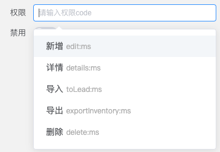

# 按钮权限

Leivii 内置了按钮级权限的相关接口，开发者可通过下面引导启用。

[按钮](../components/basic/button) 组件 `props` 中有权限字段配置如下：

```js
authCode: {
  type: String,
  clazz: 'Auth',
  label: '权限'
}
```

其中 `authCode` 为权限字段，`$auth(authCode)` 返回值为 `falsy` 时按钮不显示；`clazz` 为权限属性编辑组件，通过 [注册属性编辑器](./prop) 实现你的项目权限定制。

## 实现 `$auth` 方法

根据项目需求实现 `$auth` 方法，示例代码如下：

```js
Vue.prototype.$auth = function(code) {
  // 根据当前路由，获取 code 对应的权限。
  return getAuth(this.$route.meta.auth, code)
}
```

## 注册 `Auth` 属性编辑器

注册代码如下：

```js
import Auth from 'Auth.vue'
import { Leivii } from 'leivii-editor'

Leivii.API.registProp('Auth', Auth)
```

`Auth` 组件示例代码：

```vue
<template>
  <div class="auth-wrapper w-full">
    <el-autocomplete
      class="auth-selector"
      v-model="text"
      :size="size"
      :fetch-suggestions="querySearch"
      :trigger-on-focus="true"
      highlight-first-item
      placeholder="请输入权限code"
      @change="handleChange"
      @select="handleSelect"
    >
      <template slot-scope="{ item }">
        <div style="white-space: nowrap; overflow: hidden; text-overflow: ellipsis" :title="`${item.label} ${item.value}`">
          {{item.label}}
          <label class="fs-xs text-color-base">{{item.value}}</label>
        </div>
      </template>
    </el-autocomplete>
  </div>
</template>

<script>
import { Leivii } from 'leivii-editor'

export default {
  model: {
    prop: 'value',
    event: 'change'
  },
  props: {
    value: String,
    size: {
      type: String,
      default: 'mini'
    },
    disabled: {
      type: Boolean,
      default: false
    },
    showExpression: {
      type: Boolean,
      default: true
    }
  },
  data() {
    return {
      text: null,
      authMap: {}
    }
  },
  created() {
    this.initAuth()
    this.authMap = Leivii.Dict.authMap[this.$route.meta.auth]

    for (let code in this.authMap) {
      if (code === this.value) {
        this.text = this.$transMsg(this.authMap[code])
      }
    }
    if (!this.text) this.text = this.value
  },
  methods: {
    initAuth() {
      let authMap = Leivii.Dict.authMap
      if (Object.keys(authMap).length) return

      // 权限数据保存在本地的 MenuList 中
      let menuList = JSON.parse(localStorage.getItem('MenuList')) || []
      const getPermission = (tar, obj) => {
        if (obj.btn) {
          obj.btn.forEach(b => tar[b.code] = b.name)
        }
        if (obj.children) {
          obj.children.forEach((item) => {
            getPermission(tar, item)
          })
        }
      }

      for (let i = 0; i < menuList.length; i += 1) {
        const item = menuList[i]
        if (item.type === 2) {
          for (let k = 0; k < item.children.length; k += 1) {
            const children = item.children[k]
            const g = children.children
            const key = `${item.code.trim()}/${children.code.trim()}`
            if (g && g.length > 0) {
              for (let j = 0; j < g.length; j += 1) {
                const el = g[j]
                authMap[`${children.code.trim()}/${el.code.trim()}`] ||= {}
                el.btn.forEach(b => authMap[`${children.code.trim()}/${el.code.trim()}`][b.code] = b.name)
              }
            } else {
              authMap[key] ||= {}
              children.btn.forEach(b => authMap[key][b.code] = b.name)
            }
          }
        }
      }
    },
    querySearch(queryString, cb) {
      let list = []
      for (let code in this.authMap) {
        let label = this.$transMsg(this.authMap[code])
        let value = code
        if ((label + value).indexOf(queryString) > -1 || !queryString) {
          list.push({ label: this.$transMsg(this.authMap[code]), value: code })
        }
      }
      cb(list)
    },
    handleChange(e) {
      this.$emit('change', e)
    },
    handleSelect(e) {
      this.text = e.label
      this.$emit('change', e.value)
    }
  }
}
</script>
<style lang="scss" scoped>
.auth-wrapper {
  position: relative;
  display: flex;
  align-items: center;
  justify-content: space-between;
  .auth-selector {
    flex: 1;
  }
}
</style>
```

效果预览：


