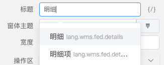

# 注册属性编辑器

在 [PropAPI](./props) 模块我们介绍了组件的属性可以通过扩展原生 `Vue Props` 的方法描述，其中的 `clazz`、`itemClazz`、`valueClazz` 指定了当前属性字段需要的具体的属性编辑器。接下来我们通过一个例子来学习下如何注册属性编辑器。

::: tip 注册属性编辑器的方法
```ts
Leivii.API.registProp(clazz: string, component: Vue)
```
:::

## 为文本颜色属性注册属性编辑器

在 [文本](../components/basic/text) 组件中，有如下的 `color` 属性声明：

```js
export default {
  props: {
    color: {
      type: String,
      clazz: 'ColorPicker',
      default: '',
      label: '颜色'
    }
  }
}
```

下面是 `ColorPicker` 组件源码：

<<< @/docs/advanced/sample/ColorPicker.vue

> 属性编辑器需要提供 `v-model` 指令，语法请移步 [自定义组件的v-model](https://cn.vuejs.org/v2/guide/components-custom-events.html#自定义组件的-v-model)。

接下来我们将 `ColorPicker` 注册为属性编辑器：

```js
import { Leivii } from 'leivii-editor'
import ColorPicker from 'ColorPicker.vue'

Leivii.API.registProp('ColorPicker', ColorPicker)
```

打开编辑器，在文本的属性面板中，可以看到 **颜色** 栏已经变成了 `ColorPicker` 组件！

::: leivii
```js
{
  "$id": "geek-text",
  "$type": "geek-text",
  "$visible": true,
  "text": "点击我看看颜色编辑器吧！",
  "color": "#FB6101",
  "fontSize": "30px"
}
```
:::


## 已有属性编辑器列表

::: tip 声明组件编辑器的方式
```js {5}
{
  "text": {
    type: String,
    label: "标题",
    clazz: "I18n"
  }
}
```

:::

> 更多配置字段请参考 [PropAPI](../advanced/props)。

### 属性编辑器描述表格

| 名称 | 中文名 | 描述 |
| ---- | ---- | ---- |
| I18n | 国际化 | 在需要国际化显示的字段上声明。|
| Theme | 主题 | 系统字段 `$classes`，为组件提供主题样式。|
| ColorPicker| 取色器 | 颜色属性编辑器。|
| TimePicker | 时间选择器 | 时间属性的编辑器。|
| AxiosInput | 接口配置 | 接口配置组件，包含请求地址、请求方法、params、data的配置。|
| FunctionInput | 函数 | 为表单项等组件提供数据过滤函数。|
| Validator | 表单验证 | 为表单项提供验证规则，详情参考 [注册表单验证](./validator)。|
| ComponentDragger | 组件拖放 | 当属性为其他组件时使用此配置，类似 `Vue Slots`。|
| DataSourcePicker | 数据源选择器 | 系统字段 `$prop`，为组件选择上下文的数据。|
| ParamPicker | 参数选择器 | 用户可以自由嵌套组装数据。|
| DictInput | 字典配置器 | 配置字典及数据类型。|
| FormItems | 表单字段配置 | 表单专用组件，选择 [数据模型](../design/datasource) 中的字段生成表单项。|
| TableColumns | 表格列配置 | 表格专用组件，选择 [数据模型](../design/datasource) 中的字段生成表格列。|
