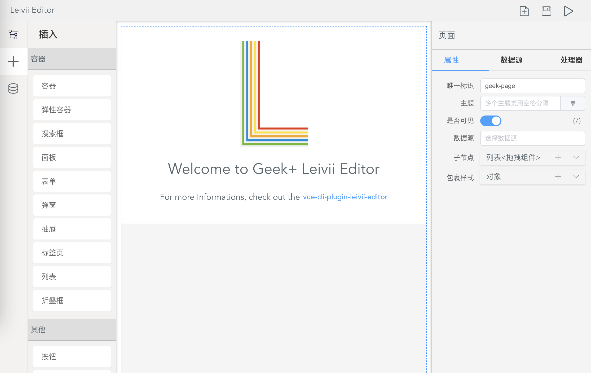

# 安装

Leivii 分为两个模块，即 [运行时 Leivii](http://gitlab.geekplus.cc/fe/low-code) 和 [编辑器 Leivii Editor](http://gitlab.geekplus.cc/fe/leivii-editor)。推荐使用[插件方式](#插件安装)安装。

::: tip 什么是运行时？
运行时，是可以解析并渲染编辑器产生的配置的组件。
:::

### 环境要求

Leivii 基于 [Vue2.x](https://cn.vuejs.org/v2/guide/) 开发，UI框架使用 [Element UI](https://element.eleme.cn/#/zh-CN)，内置 [vue-i18n](https://kazupon.github.io/vue-i18n/zh/started.html) 国际化模块。

### 更新日志

最新稳定版本：0.1.8

每个版本的更新日志见 [Gitlab](http://gitlab.geekplus.cc/fe/leivii-editor/blob/master/CHANGELOG.md)

## 插件安装

Leivii 提供了一个 Vue CLI 插件包，它为您提供了开箱即用的构建配置。只需要几分钟时间就可以让你的项目支持低代码。

```bash
# 最新稳定版
$ vue add leivii-editor
```

## Hello World

添加路由配置：将插件内置的 Editor 组件配置到路由中。

```js
{
  path: '/editor',
  name: 'Editor',
  component: () => import('@/Editor.vue')
}
```

启动服务，访问 `/editor` 路由，即可看到如下页面。



## 全局配置


配置状态仓库、国际化和请求库。
```js
import LeiviiEditor from 'leivii-editor'
import 'leivii-editor/lib/leivii-editor.css'
import Vuex from 'vuex'
import VueI18n from 'vue-i18n'
import axios from 'axios'

Vue.use(Vuex)
Vue.use(VueI18n)

const i18n = new VueI18n({
  // 你的国际化配置...
})

const store = new Vuex.Store({
  // 你的状态配置...
})

Vue.use(LeiviiEditor, {
  store, // 编辑器使用 store 注册状态模块
  i18n: (...args) => i18n.t(...args), // 国际化函数
  fetch: { axios }, // 请求库，支持REST：fetch: { GET, POST, PUT, DELETE }
  debug: false, // 打开日志
  dict: { // 字典接口配置
    url: '/api_v1/dict/batchQuery',
    method: 'post',
    key: 'objectCodes', // 请求key字段
    root: 'details', // 返回值列表字段
    label: 'fieldValue', // 显示字段
    value: 'fieldCode' // 值字段
  }
})
```

## 其他安装方式

如果需要将编辑器和运行时安装在不同的项目，可以使用 CDN / NPM 安装运行时。

### CDN

```html
<link rel="stylesheet" href="https://unpkg.com/leivii@latest/lib/leivii.css">
<script src="https://unpkg.com/leivii@latest/lib/leivii.umd.min.js"></script>
```

### NPM

``` bash
# 只安装运行时
$ npm install leivii -S
```

在项目入口文件，引入并注册 Leivii 运行时。
```js
import Leivii from 'leivii'
import 'leivii/lib/leivii.css'
Vue.use(Leivii)
```

### Hello World

使用文本组件，设置文本属性为：Hello World

```vue
<leivii :data="data" />

<script>
export default {
  data() {
    return {
      data: {
        $id: 'geek-text',
        $type: 'geek-text',
        $visible: true,
        text: 'Hello World'
      }
    }
  }
}
</script>
```

### 全局配置

配置国际化和请求库。
```js
import Leivii from 'leivii'
import 'leivii/lib/leivii.css'
import VueI18n from 'vue-i18n'
import axios from 'axios'

Vue.use(VueI18n)

const i18n = new VueI18n({
  // 你的国际化配置...
})

Vue.use(Leivii, {
  i18n: (...args) => i18n.t(...args),
  fetch: { axios },
  debug: true // 打开日志
})
```
